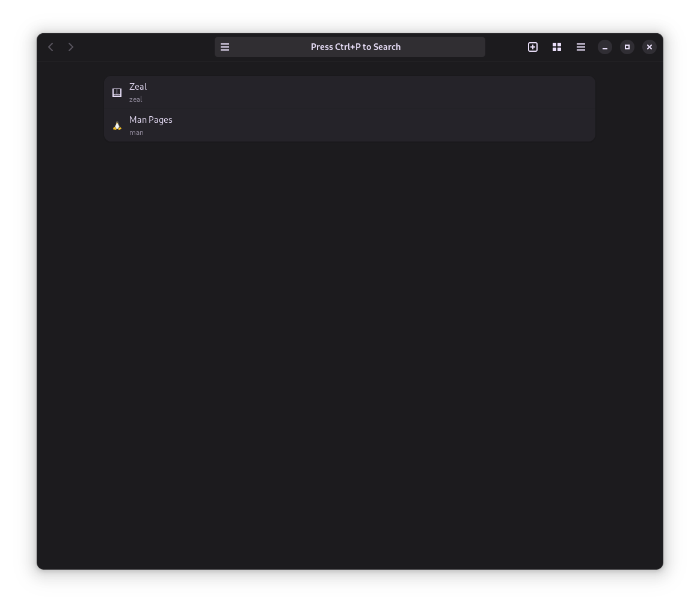
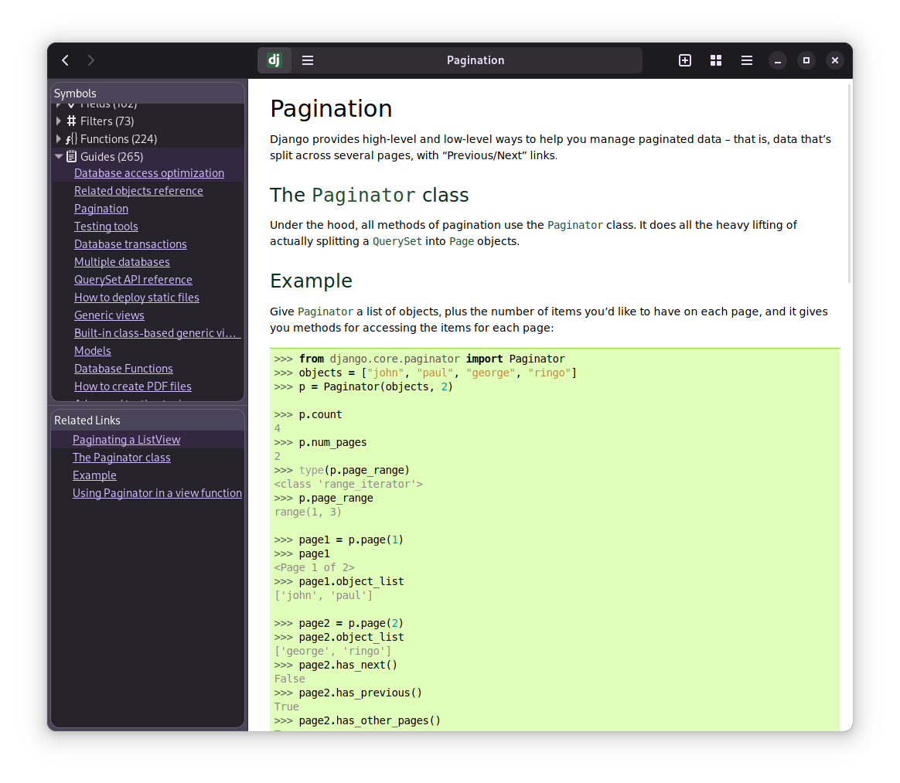

# DocoLoco

DocoLoco is a documentation browser that utilizes documentation sets provided by Zeal Docs. Please note that Zeal must be installed to use DocoLoco.

## Table of Contents

- [Installation](#installation)
- [Running the Project](#running-the-project)
- [Linux Dependencies](#linux-dependencies)
- [Development](#development)

## Preview

Here are some preview images of DocoLoco in action:

| Homepage                              | Documentation                                       | Tabs Overview                                   |
| ------------------------------------- | --------------------------------------------------- | ----------------------------------------------- |
|  |  |  |

````

## Installation

To get started with DocoLoco, follow these steps:

1. **Clone the Repository:**

   ```bash
   git clone https://github.com/your-username/DocoLoco.git
   cd DocoLoco
````

2. **Install Poetry:**

   If you haven't installed Poetry, you can do so using the following:

   ```bash
   curl -sSL https://install.python-poetry.org | python3 -
   ```

   Or refer to the [official Poetry installation guide](https://python-poetry.org/docs/#installation) for more options.

3. **Install Dependencies:**

   Use Poetry to install project dependencies:

   ```bash
   poetry install
   ```

   This will create a virtual environment and install all the necessary packages.

4. **Install Zeal:**

   Ensure that Zeal is installed on your system. You can download Zeal from [https://zealdocs.org/](https://zealdocs.org/).

## Running the Project

Now that you have the project and its dependencies installed, you can run DocoLoco using the following steps:

1. **Add Documentations:**
   Add the docsets you need using Zeal. The DocSets will automatically be populated by the application.

2. **Activate the Virtual Environment:**

   Activate the virtual environment created by Poetry:

   ```bash
   poetry shell
   ```

3. **Run DocoLoco:**

   Execute the main script or entry point of DocoLoco:

   ```bash
   python docoloco.py
   ```

   This will launch the documentation browser.

## Linux Dependencies

If you are on a Linux system, make sure you have the GTK4 development libraries installed. You can install them using the package manager for your distribution:

- **Ubuntu/Debian:**

  ```bash
  sudo apt-get install libgtk-4-dev
  ```

- **Fedora:**

  ```bash
  sudo dnf install gtk4-devel
  ```

- **Arch Linux:**

  ```bash
  sudo pacman -S gtk4
  ```

  Adjust the package names according to your distribution.

## Development

For GTK4 completion in Python, it's recommended to use [FakeGir](https://github.com/fakegir/fakegir). FakeGir provides stubs for missing GObject Introspection (GIR) files, enabling better code completion and type hinting in Python IDEs.

To install FakeGir, use the following:

```bash
pip install fakegir
```

After installing FakeGir, run it to generate the necessary stubs for GTK4:

```bash
fakegir --all
```

This will create the required files for GTK4 completion in your development environment.

## Contributing

If you would like to contribute to DocoLoco, please follow our [Contribution Guidelines](CONTRIBUTING.md).

## License

DocoLoco is licensed under the [MIT License](LICENSE).
